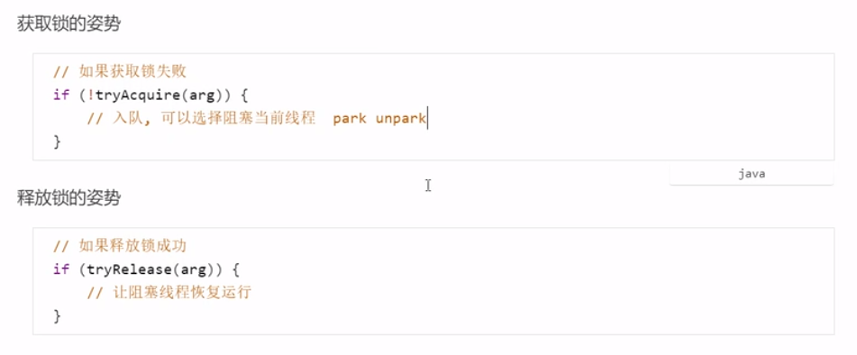
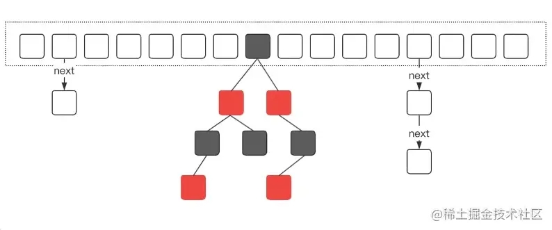

# JUC（java.util.concurrent）包的使用

官方文档：https://docs.oracle.com/en/java/javase/11/docs/api/java.base/java/util/concurrent/package-summary.html 

> 重点类：
> 	1.AtomicInteger
> 	2.Semaphore
> 	3.CountDownLatch
> 	4.ThreadLocal
> 	5.ConcurrentHashMap
> 	6.ReentrantLock

## Java内存模型

Java内存模型(即Java Memory Model，简称（JMM）本身是一种抽象的概念，是一种规范，并不真实存在，它描述的是一组规则或规范，通过这组规范定义了程序中各个变量（包括实例字段，静态字段和构成数组对象的元素）的访问方式。由于JVM运行程序的实体是线程，而每个线程创建时JVM都会为其创建一个工作内存(有些地方称为栈空间)，用于存储线程私有的数据，而Java内存模型中规定所有变量都存储在主内存，主内存是共享内存区域，所有线程都可以访问，但线程对变量的操作(读取赋值等)必须在工作内存中进行，首先要将变量从主内存拷贝的自己的工作内存空间，然后对变量进行操作，操作完成后再将变量写回主内存，不能直接操作主内存中的变量，工作内存中存储着主内存中的变量副本拷贝，前面说过，工作内存是每个线程的私有数据区域，因此不同的线程间无法访问对方的工作内存，线程间的通信(传值)必须通过主内存来完成。


JMM 定义了主存、工作内存的抽象概念，底层对应着CPU寄存器、缓存、硬件内存、CPU指令优化等。

主存：所有线程共享的数据，如成员变量、静态成员变量。

工作内存：线程私有的数据，如局部变量。

JMM体现在以下几个方面：

- 原子性：保证指令不受到线程上下文切换的影响
- 可见性：保证指令不会受CPU缓存的影响
- 有序性：保证指令不会受CPU指令并行优化的影响


线程执行过程中，会把主存中的数据读到工作内存中，JIT编译器也会将频繁访问的内容缓存到工作内存的高速缓存中，减少对主存的访问，提高效率，但也导致了缓存一致性的问题，此时可以通过volatile关键字解决。

**volatile**：可以用来修饰成员变量和静态成员变量，它可以避免线程从自己的工作缓存中查找变量的值，必须从主存中去获取变量的值，线程操作volatile变量都是直接操作主存。保证线程操作的可见性。


## CAS

全称是Compare And Awap（比较并交换值）。

CAS的特点
结合CAS和volatile可以实现无锁并发，适用于线程数少、多核CPU的场景下。

- CAS是基于乐观锁的思想:最乐观的估计，不怕别的线程来修改共享变量，就算改了也没关系，我吃亏点再重试呗。

-  synchronized是基于悲观锁的思想:最悲观的估计，得防着其它线程来修改共享变量，我上了锁你们都别想改，我改完了解开锁，你们才有机会。

  - CAS体现的是无锁并发、无阻塞并发，请仔细体会这两句话的意思
    因为没有使用synchronized，所以线程不会陷入阻塞，这是效率提升的因素之一
  - 但如果竞争激烈，可以想到重试必然频繁发生，反而效率会受影响

  

## AQS

全称是AbstractQueuedSynchronizer，是阻塞式锁和相关的同步器工具的框架。

特点:

- 用state属性来表示资源的状态（分独占模式和共享模式)，子类需要定义如何维护这个状态，控制如何获取锁和释放锁

  - getState -获取state状态 

  - setState -设置state状态

  - compareAndSetState -cas 机制设置state状态
  - 独占模式是只有一个线程能够访问资源，而共享模式可以允许多个线程访问资源

- 提供了基于FIFO的等待队列，类似于Monitor的EntryList

- 条件变量来实现等待、唤醒机制，支持多个条件变量，类似于Monitor的 WaitSet



## AtomicInteger

一个可以原子更新的int值。有关原子变量属性的描述，请参阅java.util.concurrent.atomic包规范。AtomicInteger用于原子递增计数器等应用程序，不能用作Integer的替代品。但是，这个类确实扩展了Number，以允许处理基于数字的类的工具和实用程序进行统一访问。


通过*volatile*修饰

```java
private volatile int value;
```

**volatile关键字的作用**：保证了变量的可见性（visibility）。被volatile关键字修饰的变量，如果值发生了变更，其他线程立马可见，避免出现脏读的现象。*volatile只能保证变量的可见性，不能保证对volatile变量操作的原子性*

**实例化**：

```java
// 无参
AtomicInteger atomicInteger = new AtomicInteger(); 	//初始化值为0
// 指定值
AtomicInteger atomicInteger2 = new AtomicInteger(2);
```


**方法**：

1. get()：返回当前值（int）

2. set(int newValue)：设置值

3. lazySet(int newValue)：最终设置为给定值。

   set()与lazySet(): set()会刷新缓存，保证缓存一致性，读到的值为最新值；lazySet不会刷新缓存，读到的值可能是旧值。

   ```java
   public class Atomic {
   
       AtomicInteger atomic = new AtomicInteger();
       public static void main(String[] args) {
   
           Atomic app = new Atomic();
           new Thread(() -> {
               for (int i = 0; i < 10; i++) {
                   app.atomic.lazySet(i); // 得到的结果中 get的值可能小于set的值（需要多试几遍）
                   //app.atomic.set(i); // 得到的结果中 get的值总是大于等于set的值
                   System.out.println("Set: " + i);
                   try {
                       Thread.sleep(100);
                   } catch (InterruptedException e) {
                       e.printStackTrace();
                   }
               }
           }).start();
   
           new Thread(() -> {
               for (int i = 0; i < 10; i++) {
                   synchronized (app.atomic) {
                       int counter = app.atomic.get();
                       System.out.println("Get: " + counter);
                   }
                   try {
                       Thread.sleep(100);
                   } catch (InterruptedException e) {
                       e.printStackTrace();
                   }
               }
           }).start();
       }
   }
   ```

4. getAndSet(int newValue)：原子地设置为给定值并返回旧值。

5. compareAndSet(int expect, int update)：如果当前值==预期值（expect），则自动将该值设置为给定的更新值（update）。

6. weakCompareAndSet(int expect, int update)：如果当前值==预期值，则自动将该值设置为给定的更新值。可能会错误地失败，并且不提供排序保证，所以它很少是比较andset的合适选择。

7. getAndIncrement()：将当前值原子地加1，并返回该值。

8. getAndDecrement()：将当前值原子地减1，并返回该值。

9. getAndAdd(int delta)：以原子方式将给定值（delta）添加到当前值，返回之前的值。

10. incrementAndGet()：将当前值原子地加1，返回更新后的值。

11. decrementAndGet()：将当前值原子地减1，返回更新后的值。

12. addAndGet(int delta)：以原子方式将给定值（delta）添加到当前值，返回更新后的值。

13. getAndUpdate(IntUnaryOperator updateFunction)：用应用给定函数的结果原子地更新当前值，返回前一个值。该函数应该没有副作用，因为当线程争用导致尝试更新失败时，可能会重新应用该函数。updateFunction - 一个没有副作用的函数，返回以前的值。

14. updateAndGet(IntUnaryOperator updateFunction)：用应用给定函数的结果原子地更新当前值，返回更新后的值。

    ```java
    public class Atomic2 {
        public static void main(String[] args) {
            AtomicInteger atomic = new AtomicInteger();
            AtomicInteger atomic1 = new AtomicInteger();
            IntUnaryOperator updateFunction = num -> num + 1;
            int oldValue = atomic.getAndUpdate(updateFunction);
            int current = atomic1.updateAndGet(updateFunction);
            System.out.println(oldValue);
            System.out.println(current);
        }
    }
    ```

15. getAndAccumulate(int x, IntBinaryOperator accumulatorFunction)：用将给定函数应用于当前值和给定值的结果原子地更新当前值，返回以前的值。函数的第一个参数是当前值，第二个参数是给定的更新。

16. accumulateAndGet(int x,IntBinaryOperator accumulatorFunction)：使用将给定函数应用于当前值和给定值的结果原子地更新当前值，返回更新后的值。函数的第一个参数是当前值，第二个参数是给定的更新。

    ```java
    class Atomic3 {
        public static void main(String[] args) {
            AtomicInteger atomic = new AtomicInteger();
            AtomicInteger atomic1 = new AtomicInteger(2);
            IntBinaryOperator binaryOperator = (x,y) -> x - y;
            int current = atomic.accumulateAndGet(0, binaryOperator);
            System.out.println(current);
            int oldValue = atomic1.getAndAccumulate(1, binaryOperator);
            System.out.println(oldValue);
            System.out.println(atomic1.get()); //atomic1.get() == atomic1 - 1
        }
    }
    ```

17. toString()：返回值为string类型

18. intValue()：返回值为int类型

19. longValue()：返回值为long类型

20. floatValue()：返回值为float类型

21. doubleValue()：返回值为double类型


## Semaphore

计数信号量。从概念上讲，信号量维护一组permits（许可/令牌）。如果有必要，每个人都会获取区块，直到获得许可，然后再获取。每次释放都会添加一个许可，可能会释放一个阻塞的获取者。但是，没有使用实际的permit对象;Semaphore只保留可用的数量的计数，并相应地进行操作。

信号量通常用于限制访问某些(物理或逻辑)资源的线程数量。有多个资源，也允许多个线程访问，只是限制同时访问共享资源的线程上限。（只是限制线程数量，不是限制资源数量）

理解：Semaphore就像停车场，permits就像车位数量，当线程获得了permits就像是获得了停车位，然后permits就减1。


```java
@Slf4j
class Atomic4 {

    public static void main(String[] args) {
        Semaphore semaphore = new Semaphore(3);
        for (int i = 0; i < 10; i++) {
            new Thread(() -> {
                try {
                    semaphore.acquire(); // 获取许可permits,没有许可的线程，在此等待
                    log.debug("running");
                    Thread.sleep(1);
                    log.debug("end");
                    semaphore.release(); // 释放许可
                } catch (InterruptedException e) {
                    e.printStackTrace();
                }
            }).start();
        }
    }
}
```


**方法：**

```java
acquire()  
获取一个令牌，在获取到令牌、或者被其他线程调用中断之前线程一直处于阻塞状态。

acquire(int permits)  
获取一个令牌，在获取到令牌、或者被其他线程调用中断、或超时之前线程一直处于阻塞状态。
    
acquireUninterruptibly() 
获取一个令牌，在获取到令牌之前线程一直处于阻塞状态（忽略中断）。
    
tryAcquire()
尝试获得令牌，返回获取令牌成功或失败，不阻塞线程。

tryAcquire(long timeout, TimeUnit unit)
尝试获得令牌，在超时时间内循环尝试获取，直到尝试获取成功或超时返回，不阻塞线程。

release()
释放一个令牌，唤醒一个获取令牌不成功的阻塞线程。

hasQueuedThreads()
等待队列里是否还存在等待线程。

getQueueLength()
获取等待队列里阻塞的线程数。

drainPermits()
清空令牌把可用令牌数置为0，返回清空令牌的数量。

availablePermits()
返回可用的令牌数量。
```

**实现原理：**

一、初始化

1. 当调用new Semaphore(2) 方法初始化时，默认会创建一个非公平的锁的同步阻塞队列。
2. 把初始令牌数量（2）赋值给同步队列的state状态，state的值就代表当前所剩余的令牌数量。

二、获取permits

当调用semaphore.acquire()方法时：

1. 当前线程会尝试去同步队列获取一个令牌，获取令牌的过程也就是使用原子的操作去修改同步队列的state ,获取一个令牌则修改为state=state-1。
2. 当计算出来的state<0，则代表令牌数量不足，（进入doAcquireSharedInterruptibly(arg)方法）此时会创建一个Node节点加入阻塞队列，挂起当前线程。
   - 封装一个Node节点，加入队列尾部
   - 在无限循环中，如果当前节点是头节点，就尝试获取信号
   - 不是头节点，在经过节点状态判断后，挂起当前线程
3. 当计算出来的state>=0，则代表获取令牌成功。

三、释放permits

当调用semaphore.release() 方法时

1. 线程会尝试释放一个令牌，释放令牌的过程也就是把同步队列的state修改为state=state+1的过程
2. 释放令牌成功之后，（进入doReleaseShared()方法）同时会唤醒同步队列中的一个线程。
   - 更新state加一
   - 唤醒等待队列头节点线程
3. 被唤醒的节点会重新尝试去修改state=state-1 的操作，如果state>=0则获取令牌成功，否则重新进入阻塞队列，挂起线程。


## CountdownLatch

一种同步辅助工具，它允许一个或多个线程等待，直到在其他线程中执行的一组操作完成。（用来进行线程同步协作，会让一个线程等待其他线程倒计时结束后才恢复运行）

CountDownLatch使用给定的计数进行初始化。由于调用countDown方法，await方法会阻塞直到当前计数为零，在此之后，所有等待的线程都会被释放，任何后续的await调用都会立即返回。这是一个一次性现象——计数器不能重置（同一个CountDownLatch对象，不能够重置计数）。


初始化:

```java
CountDownLatch startSignal = new CountDownLatch(3);
```

此时要想执行await方法后面的内容，就需要调用countDown方法，每次调用CountDownLatch倒计时都会减1，直到减为0，就可以执行await后续代码了。

示例：

```java
class Driver {
    public static void main(String[] args) throws InterruptedException {
        CountDownLatch startSignal = new CountDownLatch(1);
        CountDownLatch doneSignal = new CountDownLatch(3);
        for (int i = 0; i < 3; ++i) {
            new Thread(new Worker(startSignal, doneSignal)).start();
        }
        System.out.println("start");
        startSignal.countDown();      // startSignal倒计时减为0，即通知Worker可以执行await后的内容了
        System.out.println("doSomethingElse start: wait for others down");
        doneSignal.await();           // 等待doneSignal倒计时减为0，即等待Worker执行结束
        System.out.println("doSomethingElse down");
    }
}

class Worker implements Runnable {
    private final CountDownLatch startSignal;
    private final CountDownLatch doneSignal;
    Worker(CountDownLatch startSignal, CountDownLatch doneSignal) {
        this.startSignal = startSignal;
        this.doneSignal = doneSignal;
    }
    public void run() {
        try {
            startSignal.await();
            doWork();
            doneSignal.countDown();
        } catch (InterruptedException ex) {} // return;
    }

    void doWork() {
        System.out.println(Thread.currentThread().getName()+"do something");
    }
}
```

## CyclicBarrier

一种同步辅助工具，它允许一组线程全部等待彼此到达公共障碍点。CyclicBarrier在涉及固定大小的线程组的程序中很有用，这些线程组必须偶尔相互等待。该屏障称为循环屏障，因为它可以在释放等待线程后重用。

循环栅栏/屏障，用来进行线程协作，等待线程满足某个计数。初始化时设置计数个数，每个线程执行到某个需要”同步”的时刻调用await方法进行等待，当等待的线程满足计数个数时，继续执行。

CyclicBarrier 支持一个可选的 Runnable 命令，该命令在每个障碍点运行一次，在队列中的最后一个线程到达之后，但在释放任何线程之前。此屏障操作可用于在任何参与方继续之前更新共享状态。


```java
@Slf4j
class Atomic6 {

    public static void main(String[] args) {
        //线程数跟计数要一样：2，否则可能会造成两个task1执行时计数减为0了，task2执行时计数已经为0了。
        ExecutorService service = Executors.newFixedThreadPool(2);
        CyclicBarrier cyclicBarrier = new CyclicBarrier(2,() -> {
            log.debug("task1 task2 finish");
        });

        for (int i = 0; i < 3; i++) {

            service.execute(() -> {
                log.debug("task1 begin");
                try {
                    Thread.sleep(1000);
                    cyclicBarrier.await(); // 2 - 1 = 1
                } catch (InterruptedException e) {
                    e.printStackTrace();
                } catch (BrokenBarrierException e) {
                    e.printStackTrace();
                }
                log.debug("task1 finish");
            });

            service.execute(() -> {
                log.debug("task2 begin");
                try {
                    Thread.sleep(1000);
                    cyclicBarrier.await(); // 1 - 1 = 0
                } catch (InterruptedException e) {
                    e.printStackTrace();
                } catch (BrokenBarrierException e) {
                    e.printStackTrace();
                }
                log.debug("task2 finish");
            });
        }
    }
}
```


## ThreadLocal


## ConcurrentHashMap

ConcurrentHashMap在jdk1.8中的存储结构，它是由数据，单项链表，红黑树来构成，当我们去初始化一个ConcurrentHashMap实例的时候，默认会初始化一个**长度等于16**的数组，由于ConcurrentHashMap它的核心仍然是Hash表，所以必然会存在Hash冲突的问题，所以ConcurrentHashMap采用链式寻址的方式，来解决Hash表的冲突，当Hash冲突比较多的时候，会造成链表长度较长的问题，这种会使得ConcurrentHashMap中的一个数组元素的查询复杂度会增加，所以在jdk1.8里面，引入了红黑树的机制，当**数组长度大于64**并且**链表长度大于等于8**的时候，单向链表会转化成红黑树，另外随着ConcurrentHashMap的一个动态扩容（负载因子默认为0.75），一旦链表的长度小于8，红黑树会退化成单向链表



源码解析：

https://www.cnblogs.com/zhaojj/p/8942647.html


扩容时hash地址计算方法：

https://blog.csdn.net/zl1zl2zl3/article/details/88410963


## ReentrantLock

一种可重入互斥锁，其基本行为和语义与使用同步方法和语句访问的隐式监视器锁相同，但具有扩展功能。

 ReentrantLock 由上次成功锁定但尚未解锁的线程拥有。当锁不被另一个线程拥有时，调用锁的线程将返回，成功获取锁。如果当前线程已经拥有锁，该方法将立即返回。这可以使用方法 isHeldByCurrentThread 和 getHoldCount 进行检查。

此类的构造函数接受一个可选的公平参数。当设置为 true 时，在争用情况下，锁有利于授予对等待时间最长的线程的访问权限。否则，此锁不保证任何特定的访问顺序。使用由许多线程访问的公平锁的程序可能会显示出比使用默认设置的程序更低的整体吞吐量（即，更慢；通常要慢得多），但在获取锁和保证不会出现饥饿的情况下具有较小的时间差异。但是请注意，锁的公平性并不能保证线程调度的公平性。因此，使用公平锁的许多线程之一可能会连续多次获得它，而其他活动线程没有进展并且当前没有持有锁。另请注意，不定时的 tryLock() 方法不遵守公平设置。如果锁可用，即使其他线程正在等待，它也会成功。


相对于synchronized的区别：

- 可中断
- 可设置超时时间
- 可设置为公平锁
- 支持多个条件变量

两者都支持可重入


可重入：是指同一个线程如果首次获得了这把锁，那么因为他是这把锁的拥有者，因此有权利再次拥有这把锁，如果是不可重入锁，那么第二次获得锁时，也不能再次获取到锁。

基本使用：

```java
class Atomic7{
    static ReentrantLock lock = new ReentrantLock();
    public static void main(String[] args) {
        lock.lock();
        try {
            // 如果没获取到锁，则不会进入m1(),进入了则证明可重入
            m1();
        } finally {
            lock.unlock();
        }
    }

    public static void m1(){
        lock.lock();
        try {
            System.out.println("进入m1方法");
            // 如果没获取到锁，则不会进入m2(),进入了则证明可重入
            m2();
        } finally {
            lock.unlock();
        }
    }

    public static void m2(){
        lock.lock();
        try {
            System.out.println("进入m2方法");
        } finally {
            lock.unlock();
        }
    }
}
```


**中断锁**

lock.lock() 不能被中断。synchronized也不能被中断，可以通过ReentrantLock 的**lockInterruptibly()**方法加锁，用**interrupt()**进行中断。

```java
class Atomic8{
    private static ReentrantLock lock = new ReentrantLock();
    public static void main(String[] args) {
        Thread thread1 = new Thread(() -> {
            try {
                //如果没有获取到锁，就进入阻塞队列，可以被其他进程用interrupt中断
                System.out.println("尝试获取锁");
                lock.lockInterruptibly();// 可以打断
//                lock.lock();//不会被中断，会一直阻塞
            } catch (Exception e){
                e.printStackTrace();
                System.out.println("没有获取到锁");
                return;
            }
            try {
                System.out.println("获取到锁");
            } finally {
                lock.unlock();
            }
        },"thread1");
        lock.lock();
        thread1.start();
        for (int i = 0; i < 5; i++) {
            if(i == 4){
                System.out.println("中断");
                thread1.interrupt();//中断
            }
        }
    }
}
```


**锁超时**

尝试获取锁：tryLock()

```java
class Atomic9{
    private static ReentrantLock lock = new ReentrantLock();
    public static void main(String[] args) {
        Thread thread1 = new Thread(() -> {
            System.out.println("thread1:尝试获取锁");
            if(! lock.tryLock()) {//main线程获取到了锁后，尝试获取锁失败
                System.out.println("thread1:没有获取到锁");
                return;
            }
            try {
                System.out.println("thread1:获取到锁");
            } finally {
                lock.unlock();
            }
        },"thread1");
        lock.lock();//main线程获取到了锁
        System.out.println("main:获取到锁");
        
        thread1.start();
    }
}
```

设置超时时间：

```java
class Atomic10{
    private static ReentrantLock lock = new ReentrantLock();
    public static void main(String[] args) {
        Thread thread1 = new Thread(() -> {
            System.out.println("thread1:尝试获取锁");

            try {
                if(! lock.tryLock(1,TimeUnit.SECONDS)) {//如果1s内获取到了锁，则返回true
                    System.out.println("thread1:没有获取到锁");
                    return;
                }
            } catch (InterruptedException e) {
                e.printStackTrace();
                System.out.println("thread1:没有获取到锁");
            }
            try {
                System.out.println("thread1:获取到锁");
            } finally {
                lock.unlock();
            }
        },"thread1");
        lock.lock();
        System.out.println("main:获取到锁");
//        System.out.println("main:释放了锁");
//        lock.unlock();
        thread1.start();
    }
}
```


**条件变量**：

ReentrantLock支持用Condition的await()方法让线程进入等待，通过Condition的signal()和signalAll()方法进行唤醒。

使用流程：

- await前需要获得锁
- await执行后会释放锁，进入conditionObject等待，类似于synchronized的waitSet（理解为房间、休息室），但它只有一个，而ReentrantLock有多个。
- await的线程被唤醒（或打断、或超时）后重新竞争锁。
- 获取lock锁成功后则继续执行。


```java
class Atomic11{
    private static ReentrantLock lock = new ReentrantLock();
    static Condition hospital = lock.newCondition(); //医院
    static Condition chamber = lock.newCondition(); //会所
    static boolean health = false;
    static boolean money = false;
    public static void main(String[] args) {
        new Thread(() -> {
            lock.lock();
            try{
                while(! health){
                    System.out.println("sick");
                    try {
                        hospital.await(); //lock()先获取锁
                    } catch (InterruptedException e) {
                        e.printStackTrace();
                    }
                }
                if(health){
                    System.out.println("healthy");
                }
            } finally {
                lock.unlock();
            }
        },"t1").start();

        new Thread(() -> {
            lock.lock();
            try{
                while(!money){
                    System.out.println("poor");
                    try {
                        chamber.await();
                    } catch (InterruptedException e) {
                        e.printStackTrace();
                    }
                }
                if(money){
                    System.out.println("rich");
                }
            } finally {
                lock.unlock();
            }
        },"t2").start();

        try {
            Thread.sleep(1000);
        } catch (InterruptedException e) {
            e.printStackTrace();
        }

        new Thread(() -> {
            lock.lock();
            try{
                health = true;
                System.out.println("doctor save you!");
                hospital.signal(); //唤醒Condition（hospital）中的线程
            } finally {
                lock.unlock();
            }
        },"t3").start();

        try {
            Thread.sleep(1000);
        } catch (InterruptedException e) {
            e.printStackTrace();
        }
        new Thread(() -> {
            lock.lock();
            try{
                if(health){
                    money  = true;
                    System.out.println("rich woman save you!");
                    chamber.signal();
                }
            } finally {
                lock.unlock();
            }
        },"t4").start();

        try {
            Thread.sleep(100);
        } catch (InterruptedException e) {
            e.printStackTrace();
        }
        while(health && money){
            System.out.println("more happiness");
            break;
        }
    }
}
```


LockSupport的park()、unpark()方法

```java
class Atomic12{
    private static boolean flag = false;
    public static void main(String[] args) {
        Thread t1 = new Thread(() -> {
            while(!flag) {
                LockSupport.park();
            }
            System.out.println("再打印t1");
        });

        Thread t2 = new Thread(() -> {
            System.out.println("先打印t2");
            flag = true;
            try {
                Thread.sleep(1000);
            } catch (InterruptedException e) {
                e.printStackTrace();
            }
            LockSupport.unpark(t1);	// 唤醒t1线程
        });

        t1.start();
        t2.start();
    }
}
```

应用：

- 互斥：使用synchronized或Lock达到共享资源互斥效果。
- 同步：使用wait、notify或lock的条件变量来达到线程间通信的作用。


